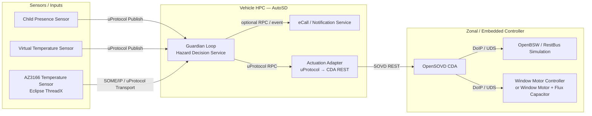
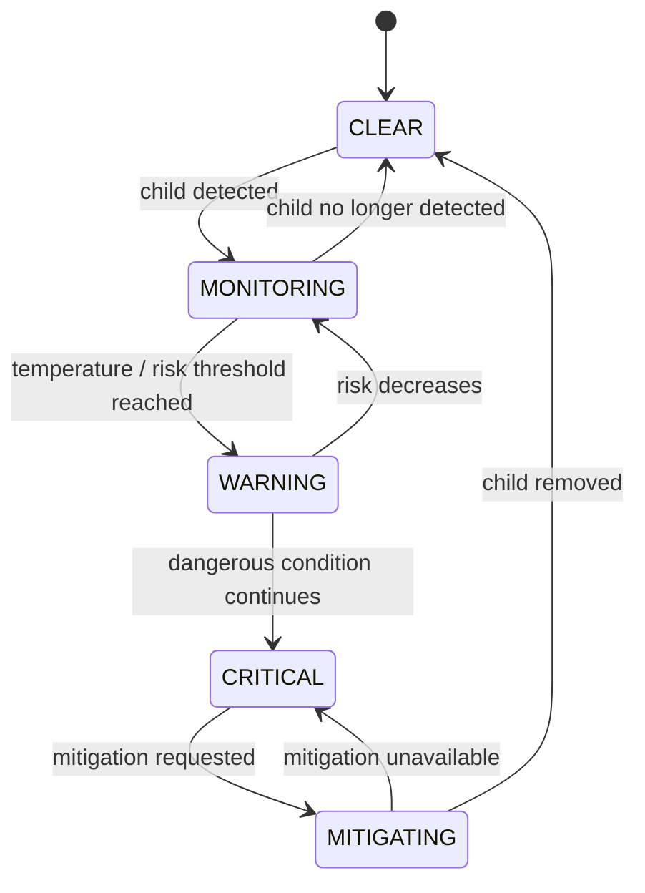
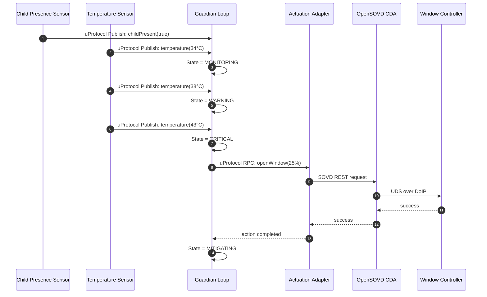

# Hack to the Future 🚗⚡

> **Where we're going, we don't need cables!**

## The Challenge

Software-defined vehicles need features that can move smoothly from a developer laptop, to a virtual vehicle, to a hardware test bench, and finally to a real vehicle.

That sounds simple until the feature depends on sensors, ECUs, operating systems, network transports, diagnostic protocols, and vehicle hardware.

**Hack to the Future** challenges you to build an SDV feature once and then take it through different execution environments **without rewriting the feature itself**.

You will start with simulated sensors and actuators, develop the application as distributed services, and then progressively replace virtual components with embedded controllers and real hardware.

The challenge combines four main technologies:

- **Eclipse uProtocol** for transport-independent service communication.
- **[Eclipse openDuT](https://opendut.eclipse.dev/)** for creating and switching between virtual and physical test environments.
- **Eclipse OpenBSW / Eclipse OpenSOVD** for accessing embedded ECU functionality.
- **AutoSD** as the Linux-based HPC platform on which the main vehicle application can run.

The reference application is called the **Guardian Loop**.

---

# Your Mission

Build a portable **Child Presence Detection and Mitigation** feature.

The vehicle has been parked. A child may still be inside. The cabin temperature is increasing.

Your software must:

1. detect whether a child is present,
2. observe the cabin temperature,
3. determine whether the situation is becoming hazardous,
4. warn or intervene,
5. command vehicle functions such as:
   - opening a window,
   - running a fan,
   - sounding an alarm,
   - triggering another vehicle service,
6. continue working when simulated components are replaced with real embedded hardware.

The key challenge is not simply detecting a child.

The key challenge is:

> **Can the same Guardian Loop service run against a simulated vehicle, an embedded test bench, and real vehicle components without changing its business logic?**

Only configuration, deployment, transport bindings, or topology should have to change.

---

# Why Child Presence Detection?

A child unintentionally left inside a parked vehicle can be exposed to dangerous cabin temperatures.

The Guardian Loop is inspired by the **Child Presence Detection** functionality evaluated by Euro NCAP.

For this hackathon, however, you are **not expected to implement or certify a complete Euro NCAP compliant system**.

Instead, the Euro NCAP use case gives us a realistic automotive problem that requires:

- sensing,
- event communication,
- vehicle state,
- decision logic,
- warnings,
- intervention,
- embedded controllers,
- heterogeneous networks,
- and hardware/software integration.

That makes it an ideal Software-Defined Vehicle challenge.

---

# The Golden Rule

## Keep the Guardian Logic portable

Your Guardian business logic should not care whether a temperature value comes from:

- a software simulator,
- an AZ3166 running Eclipse ThreadX,
- a physical temperature sensor,
- SOME/IP,
- another uProtocol transport,
- or a different machine entirely.

Likewise, the Guardian service should not care whether its window command reaches:

- a simulated RestBus,
- an OpenBSW ECU,
- a ThreadX controller,
- or the Window Motor + Flux Capacitor setup.

Your service should communicate through stable service interfaces.

**Do not couple the business logic to the hardware.**

---

# Target Architecture

The architecture can be understood as three domains.



The physical location of the boxes is intentionally not fixed.

That is part of the challenge.

A service that starts on your laptop may later run inside the AutoSD HPC. A simulated ECU may later be replaced by a real controller.

---

# Communication Philosophy

The challenge uses two complementary concepts.

## uProtocol — keep services independent

Use uProtocol for communication between application-level services.

Typical patterns are:

### Publish / Subscribe

Use events for continuously changing vehicle information.

Examples:

- child detected,
- child no longer detected,
- cabin temperature changed,
- vehicle locked,
- warning state changed.

A producer publishes the event without knowing who consumes it.

The Guardian Loop subscribes to the information it needs.

### RPC

Use RPC when one service asks another service to perform an operation.

Examples:

- open the window,
- activate the fan,
- sound the alarm,
- request an emergency notification.

The Guardian Loop asks for an action.

It should not contain the implementation of that action.

---

# openDuT — change the vehicle underneath your application

Eclipse openDuT represents the test environment.

The environment may contain:

- virtual devices,
- containers,
- simulated ECUs,
- physical ECUs,
- development boards,
- network interfaces,
- or complete Hardware-in-the-Loop setups.

For this challenge, openDuT is the mechanism used to move between test configurations.

Conceptually you should be able to go from:

```text
Virtual Sensor
      +
Guardian Loop
      +
Virtual Window Controller
```

to:

```text
Real Sensor
      +
Guardian Loop
      +
Virtual Window Controller
```

and finally:

```text
Real Sensor
      +
Guardian Loop
      +
Real Window Controller
```

without modifying the Guardian Loop implementation.

The exact openDuT cluster and device configuration will be provided with the hackathon environment.

Do not hard-code physical device IP addresses into the Guardian business logic.

---

# Building Blocks

## 1. Guardian Loop — Child Hazard Decision Service

**This is the heart of the challenge.**

It should run as an application/service on the AutoSD-based HPC environment or, during development, as the same service in a container or on your development machine.

The Guardian Loop consumes:

```text
Child Presence
Cabin Temperature
Optional Vehicle State
Optional Door / Lock State
Optional elapsed time
```

and produces:

```text
Hazard State
Warning Events
Mitigation Requests
```

The Guardian Loop should contain only the decision logic.

It should not directly:

- access GPIO,
- open serial ports,
- call UDS,
- access a CAN interface,
- access the AZ3166,
- control a window motor,
- depend on a specific SOME/IP stack.

Those responsibilities belong to adapters and services.

---

# 2. Child Presence Sensor

The Child Presence Sensor tells the system whether a child has been detected inside the vehicle.

For the first development stage, this can be a simulated service.

It should publish child-presence information through uProtocol.

A minimal event could conceptually contain:

```text
ChildPresence
    present: true | false
    confidence: 0.0 .. 1.0
    zone: optional vehicle zone
    timestamp: event time
```

You may improve the service with:

- seat position,
- detected movement,
- confidence,
- multiple occupants,
- child/adult classification,
- sensor health.

For the challenge, **a simulated sensor is completely acceptable for the first milestone**.

---

# 3. Temperature Sensor

The cabin temperature is the second main input to the Guardian Loop.

Start with a simulated sensor.

A minimal event could contain:

```text
CabinTemperature
    temperature_celsius: 38.4
    timestamp: event time
    sensor_status: OK
```

The simulator should allow you to deliberately create dangerous scenarios.

For example:

```text
25 °C
28 °C
31 °C
34 °C
38 °C
42 °C
```

Do not spend your entire hackathon building a thermodynamic model.

The important part is the end-to-end SDV architecture.

---

# 4. AZ3166 + Eclipse ThreadX Temperature Sensor

The physical sensor path replaces the software temperature simulator.

The hackathon setup may provide an **AZ3166 board running Eclipse ThreadX**.

The board represents a real embedded sensor ECU.

Its responsibility is simple:

```text
Read temperature
      ↓
Expose / publish temperature
      ↓
Vehicle network
      ↓
Guardian Loop
```

The sketch uses **SOME/IP** for this path.

The important architectural constraint is:

> SOME/IP belongs in the communication or transport integration layer, not in the Guardian hazard algorithm.

When you switch from the virtual sensor to the AZ3166, the Guardian service interface should remain the same.

---

# 5. AutoSD HPC

The main Guardian Loop service should ultimately run in the provided HPC environment based on **AutoSD**.

Treat the HPC as the vehicle's central compute platform.

A typical deployment contains:

```text
AutoSD HPC
├── Guardian Loop
├── uProtocol runtime / transport
├── Actuation Adapter
├── optional eCall service
└── logging / diagnostics
```

During initial development, running the same services on your laptop or in containers is fine.

The important demonstration is that the **same application artifact** can later be deployed on the HPC.

---

# 6. CDA REST Service / Actuation Adapter

The Guardian Loop should not call UDS directly.

Instead, place an adapter between the application and the diagnostic world.

Conceptually:

```text
Guardian Loop
      │
      │ uProtocol RPC
      ▼
Actuation Adapter
      │
      │ SOVD REST
      ▼
Classic Diagnostic Adapter
```

This service receives a high-level request such as:

```text
OpenWindow(percentage = 25)
```

and converts it into the appropriate SOVD operation.

This separation is important.

The Guardian Loop knows about:

```text
OPEN WINDOW
```

The CDA knows about:

```text
SOVD
UDS
DoIP
ECU identifiers
DIDs
routines
diagnostic sessions
```

The Guardian Loop should not.

---

# 7. OpenSOVD Classic Diagnostic Adapter

The Classic Diagnostic Adapter, or **CDA**, provides the bridge between service-oriented diagnostics and a traditional ECU.

The basic communication chain is:

```text
HTTP / SOVD
     ↓
OpenSOVD CDA
     ↓
DoIP
     ↓
UDS
     ↓
ECU
```

A working example of this pattern is available in the provided **OpenBSW SOVD Demo**.

Use it as a starting point rather than implementing a diagnostic stack from scratch.

The demo already illustrates the separation between:

```text
REST Client
    ↓
SOVD CDA
    ↓
DoIP / UDS
    ↓
OpenBSW ECU
```

Your challenge is to connect that pattern to the Guardian Loop.

---

# 8. OpenBSW Window Controller

One possible southbound target is an OpenBSW-based ECU.

During early development this ECU can run as a software simulation.

Later it can represent or be replaced by a physical zonal controller.

The controller should expose the minimum functionality needed for the scenario.

For example:

```text
WindowPositionRead
WindowPositionWrite
FanStateWrite
AlarmStateWrite
```

You do not need to implement every possible automotive diagnostic service.

Focus on the Guardian Loop scenario.

---

# 9. RestBus Simulation

The **RestBus Sim** represents the vehicle hardware that is not physically present.

Use it to create your first fully virtual setup.

For example:

```text
Guardian Loop
      ↓
CDA
      ↓
OpenBSW Window Motor Controller
      ↓
RestBus Sim
```

Your first target should be to make this configuration work before touching real hardware.

A successful virtual vehicle is not a shortcut.

It is the first stage of the portability journey.

---

# 10. Window Motor + Flux Capacitor

A second actuator target in the hackathon setup is the **Window Motor with Flux Capacitor**.

Treat this as the hardware-specific target supplied on site.

The same high-level request used for the simulated setup should eventually operate this target.

For example:

```text
Guardian Loop:
    OpenWindow(25%)
```

should remain unchanged while openDuT switches the environment from:

```text
Simulated Window
```

to:

```text
Window Motor + Flux Capacitor
```

Any hardware-specific mapping belongs in the controller, CDA configuration, or adapter.

---

# 11. eCall / Notification Service

The eCall block is an optional escalation service.

For the hackathon, it should be implemented as a **simulation or mock notification service**.

Do not connect the prototype to a real emergency call infrastructure.

Possible behavior:

```text
Guardian Loop
      ↓
Hazard = CRITICAL
      ↓
eCall Service
      ↓
Log / UI / mock backend notification
```

Example information:

```text
event: CHILD_HAZARD
temperature: 43.2 °C
child_present: true
vehicle_state: PARKED
mitigation_active: true
```

You can also use the service to demonstrate another uProtocol RPC or event flow.

---

# Suggested Service Contract

To make the feature portable, agree on the service boundary before implementing the hardware.

A simple contract could look like this.

## Sensor Events

```text
ChildPresenceEvent
    present: bool
    confidence: float
    zone: string
    timestamp_ms: uint64
```

```text
CabinTemperatureEvent
    temperature_celsius: float
    timestamp_ms: uint64
    sensor_status: enum
```

## Guardian Output

```text
GuardianStateEvent
    state:
        CLEAR
        MONITORING
        WARNING
        CRITICAL
        MITIGATING

    child_present: bool
    temperature_celsius: float
    temperature_rate: optional float
```

## Actuator RPC

```text
SetWindowPosition
    window: enum
    percentage: 0 .. 100
```

```text
SetFan
    enabled: bool
    level: optional integer
```

```text
SetAlarm
    enabled: bool
```

These names are suggested challenge-level interfaces.

Map them to the uProtocol service definition and generated bindings provided or created by your team.

---

# Suggested Guardian State Machine

A simple Guardian implementation can start with five states.



You decide the thresholds.

For example:

```text
CLEAR
No child detected.

MONITORING
Child detected but environment currently safe.

WARNING
Child detected and temperature is elevated or rising.

CRITICAL
Child detected and temperature exceeds the team's dangerous-condition threshold.

MITIGATING
Vehicle intervention has been requested.
```

More advanced implementations can include:

- temperature rate of change,
- elapsed exposure time,
- sensor confidence,
- multiple sensors,
- degraded operation,
- actuator feedback,
- locked/unlocked state,
- warning acknowledgement.

---

# Development Journey

The challenge is intentionally incremental.

Do not begin by connecting every physical component.

---

## Stage 1 — Guardian Loop on your laptop

Build:

```text
Simulated Child Sensor
        │
        ├── uProtocol
        ▼
    Guardian Loop
        ▲
        ├── uProtocol
        │
Simulated Temperature Sensor
```

At this point simply print the Guardian state.

Expected demonstration:

```text
Child: false | Temperature: 26°C → CLEAR
Child: true  | Temperature: 26°C → MONITORING
Child: true  | Temperature: 36°C → WARNING
Child: true  | Temperature: 43°C → CRITICAL
```

---

## Stage 2 — Add simulated actuation

Add:

```text
Guardian Loop
      │
      │ uProtocol RPC
      ▼
Actuation Adapter
      │
      ▼
CDA / OpenBSW
      │
      ▼
RestBus Simulation
```

When Guardian reaches your intervention threshold, something visible should happen.

For example:

```text
Window → 25%
```

or:

```text
Fan → ON
```

or:

```text
Alarm → ON
```

You now have an end-to-end SIL solution.

---

## Stage 3 — Run the Guardian service on AutoSD

Move the Guardian service onto the AutoSD HPC environment.

Do not rewrite it.

The application should use the same:

- service definitions,
- event handling,
- state machine,
- RPC interfaces.

Only deployment and runtime configuration should change.

---

## Stage 4 — Replace the temperature simulator

Replace:

```text
Virtual Temperature Sensor
```

with:

```text
AZ3166
+
Eclipse ThreadX
+
SOME/IP / uProtocol integration
```

Do not modify the Guardian hazard logic.

Demonstrate that the Guardian service cannot tell which sensor implementation is behind the service interface.

---

## Stage 5 — Replace the simulated actuator

Use openDuT to switch the actuator side.

From:

```text
RestBus / simulated controller
```

to:

```text
OpenBSW physical target
```

or:

```text
Window Motor + Flux Capacitor
```

Again, the Guardian Loop should remain unchanged.

---

# The openDuT Moment 🚀

This is the core demonstration of the challenge.

Show your feature running.

Then change the test environment.

Not the feature.

For example:

```text
T0

Child Presence Simulator
Temperature Simulator
Guardian Loop
Virtual Window Controller
```

Then:

```text
T1

Child Presence Simulator
AZ3166 Temperature Sensor
Guardian Loop
Virtual Window Controller
```

Then:

```text
T2

Child Presence Simulator
AZ3166 Temperature Sensor
Guardian Loop
Real Window Controller
```

If possible, make the topology change through openDuT rather than manually unplugging and reconnecting the test bench.

**Where we're going, we don't need cables.**

---

# End-to-End Message Flow

A complete critical-temperature scenario may look like this:



---

# NCAP-Inspired Bonus Behaviour

Teams that want to move closer to the reference safety scenario can add a more detailed warning sequence.

For example:

```text
Child detected in parked / locked vehicle
        ↓
Initial warning
        ↓
Child still present
        ↓
Escalation warning
        ↓
Hazard persists
        ↓
Vehicle intervention
```

Possible interventions:

- horn,
- hazard lights,
- window opening,
- ventilation,
- remote notification.

This is an **NCAP-inspired exercise**, not a certification implementation.

Teams interested in the current Euro NCAP behavior should consult the latest Child Presence Detection and Occupant Monitoring protocols rather than treating the simplified challenge logic as normative.

---

# Failure Handling

A good vehicle feature also works when something is broken.

Consider what Guardian should do when:

```text
Temperature sensor disappears.
```

```text
Child sensor reports invalid data.
```

```text
uProtocol communication is interrupted.
```

```text
CDA cannot reach the ECU.
```

```text
Window motor does not acknowledge the request.
```

```text
The physical test bench is replaced while the application is running.
```

Possible improvements include:

- timeout handling,
- stale-data detection,
- retries,
- degraded-state events,
- health monitoring,
- fallback actuators,
- sensor plausibility checks.

---

# Suggested Challenge Levels

## Level 1 — Great Scott!

Build the Guardian Loop using only software simulation.

Requirements:

- simulated child presence,
- simulated cabin temperature,
- uProtocol events,
- Guardian decision logic,
- visible hazard-state output.

**Goal:** demonstrate the functional concept.

---

## Level 2 — 1.21 Gigawatts

Connect the Guardian Loop to an actuator.

Requirements:

- Level 1,
- uProtocol RPC,
- actuation adapter,
- SOVD/CDA,
- OpenBSW or RestBus simulated ECU,
- window, fan, or alarm action.

**Goal:** demonstrate the complete sensing → decision → actuation loop.

---

## Level 3 — Roads? Where We're Going…

Move part of the system onto hardware.

Examples:

- AZ3166 + ThreadX temperature sensor,
- OpenBSW embedded controller,
- Window Motor + Flux Capacitor,
- AutoSD HPC.

Requirements:

- Guardian Loop source code remains unchanged,
- virtual and physical components expose the same service contract.

**Goal:** demonstrate software portability.

---

## Level 4 — Time Traveller

Use openDuT to switch between two configurations.

For example:

```text
SIL
↓
Mixed SIL/HIL
↓
HIL
```

without rebuilding or modifying Guardian.

**Goal:** demonstrate a software-defined test bench.

---

# Recommended Demo

A strong final demonstration can be completed in a few minutes.

### Scene 1 — Everything is safe

```text
Child presence: false
Cabin: 25°C
Guardian: CLEAR
```

### Scene 2 — Child detected

```text
Child presence: true
Cabin: 27°C
Guardian: MONITORING
```

### Scene 3 — Cabin heats up

```text
Cabin: 36°C
Guardian: WARNING
```

### Scene 4 — Critical condition

```text
Cabin: 43°C
Guardian: CRITICAL
```

The Guardian Loop requests:

```text
Window → OPEN 25%
Alarm → ON
```

### Scene 5 — Jump through time

Use openDuT to replace a simulated endpoint.

For example:

```text
Virtual Temperature Sensor
        ↓
AZ3166 + ThreadX
```

Repeat the experiment.

Guardian still works.

### Scene 6 — Jump again

Replace the simulated window controller with the physical actuator.

Repeat the experiment.

The Guardian business logic still works.

That is the point of the challenge.

---

# Definition of Done

A successful solution should demonstrate:

- [ ] Child presence information reaches Guardian.
- [ ] Temperature information reaches Guardian.
- [ ] Communication uses service interfaces rather than hardware-specific calls.
- [ ] Guardian evaluates the risk.
- [ ] Guardian exposes its current state.
- [ ] Guardian can request at least one mitigation action.
- [ ] The action reaches a simulated ECU or actuator.
- [ ] uProtocol is used for at least one publish/subscribe flow.
- [ ] uProtocol is used for at least one service/RPC interaction.
- [ ] Guardian runs independently of the underlying transport implementation.
- [ ] At least one endpoint can be replaced without changing Guardian's business logic.

For the full challenge:

- [ ] Guardian runs on the AutoSD HPC.
- [ ] openDuT is used to manage or switch the test topology.
- [ ] At least one real embedded endpoint replaces a simulated endpoint.
- [ ] The same Guardian service artifact is used before and after the switch.

Bonus:

- [ ] Both sensor and actuator are moved to physical hardware.
- [ ] SOME/IP is integrated.
- [ ] eCall/notification mock is implemented.
- [ ] failure handling is demonstrated.
- [ ] Flux Capacitor or Time Circuits are controlled.

---

# What Not to Do

Avoid spending the whole hackathon on infrastructure that already exists.

You do **not** need to:

- implement UDS from scratch,
- implement DoIP from scratch,
- build a new SOVD server from scratch,
- write a custom networking protocol,
- create a physically accurate cabin-temperature model,
- build a production-ready child detector.

Reuse the building blocks.

Spend your time connecting them and demonstrating portability.

---

# Safety

This is a prototype and hackathon environment.

Do not test the scenario using a real child, animal, or person locked inside a vehicle.

Use:

- simulated occupancy,
- approved test objects,
- software events,
- or the hardware surrogates supplied by the organizers.

Physical actuators must be operated only within the limits specified by the hackathon organizers.

The eCall example must use a mock endpoint only and must not contact real emergency services.

---

# Useful Starting Points

The following existing work is especially useful for this challenge.

### OpenBSW SOVD Demo

Repository:

```text
Eclipse-SDV-HackFest-Esslingen-2026/OpenBSW-Playground
```

Look at:

```text
OpenBSW-SOVD-Demo/
```

It contains a working example of:

```text
REST / SOVD
↓
CDA
↓
DoIP / UDS
↓
OpenBSW
```

Use this for the actuator side of the Guardian Loop.

---

### Commercial SDV Stack

Repository:

```text
eclipse-sdv-blueprints/commercial-sdv-stack
```

This is particularly useful as a uProtocol and CDA integration example.

Its Powertrain Mode example demonstrates the architectural pattern:

```text
uProtocol RPC
↓
Vehicle uService
↓
SOVD REST
↓
CDA
↓
UDS ECU
```

The Guardian actuator flow can follow the same pattern.

---

### Eclipse uProtocol

Start with:

```text
eclipse-uprotocol/up-spec
```

Focus on:

```text
Publish / Subscribe
RPC
Transport abstraction
```

Use your preferred supported language binding, particularly Rust or C++.

---

### Eclipse openDuT

Repository:

```text
eclipse-opendut/opendut
```

Use openDuT to model the participating devices and to move the setup from virtual devices toward the physical hackathon test bench.

---

### AutoSD

Use the AutoSD image and environment supplied for the hackathon as the deployment target for the Guardian Loop and associated HPC services.

---

# Suggested Team Split

For a team of four, a productive split is:

### Guardian / uProtocol

Build the Guardian state machine and uProtocol service interfaces.

### Sensors

Implement child-presence and temperature publishers and later integrate the AZ3166.

### ECU / SOVD

Connect the actuation adapter to CDA, OpenBSW, RestBus, and the physical controller.

### Integration / openDuT

Create the deployment, networking, topology switching, logging, and final demo.

Integrate early.

Do not wait until the final hour to connect the components.

---

# Prerequisites

You should be comfortable with some of the following:

- basic **Rust and/or C++**,
- Linux,
- containers,
- publish/subscribe messaging,
- basic networking.

Helpful but not required:

- SOME/IP,
- UDS,
- DoIP,
- SOVD,
- embedded development,
- Eclipse ThreadX.

The supplied building blocks are intended to let you learn those concepts during the challenge.

---

# The Question to Answer

At the end of the hackathon, your demo should answer one question:

> **Can an SDV feature developed against virtual vehicle components move to embedded controllers and real hardware without changing the feature itself?**

If the child sensor changes…

If the temperature sensor changes…

If the network transport changes…

If the controller changes…

If the vehicle test bench changes…

…but the Guardian Loop keeps running:

**you have completed the mission.**

> **Great Scott. That's a Software-Defined Vehicle.**
