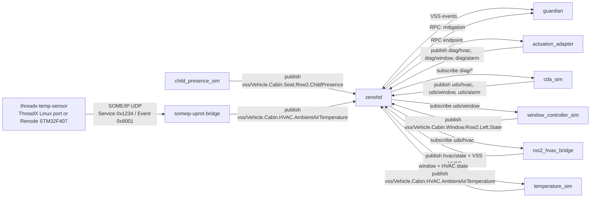
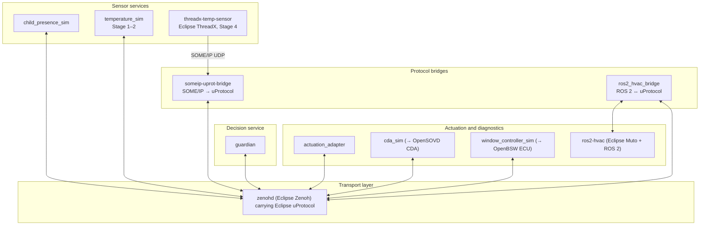

# Tutorial — run the reference stack and watch the Guardian Loop work

This tutorial gets the reference implementation running on your laptop and
walks you through what happens, service by service, so you know what you are
about to replace. Budget about 20 minutes. No Rust or ROS 2 installation is
needed; everything runs in containers.

You should have read the mission in [README.md](README.md). For *what to copy
from* when you start building, continue with [Guardian-loop.md](Guardian-loop.md).

Contents:

1. [Prerequisites](#1-prerequisites)
2. [Start the default stack](#2-start-the-default-stack)
3. [Watch the Guardian Loop escalate](#3-watch-the-guardian-loop-escalate)
4. [Poke the services](#4-poke-the-services)
5. [Add the ROS 2 HVAC workload](#5-add-the-ros-2-hvac-workload)
6. [Inject an HVAC fault and watch the escalation change](#6-inject-an-hvac-fault-and-watch-the-escalation-change)
7. [Add the ThreadX / SOME-IP sensor path](#7-add-the-threadx--some-ip-sensor-path)
8. [Message flow and architecture diagrams](#8-message-flow-and-architecture-diagrams)
9. [Develop and rebuild](#9-develop-and-rebuild)
10. [Troubleshooting](#10-troubleshooting)
11. [Appendix: ROS 2 GUI tools (rqt) and Windows/WSL notes](#11-appendix-ros-2-gui-tools-rqt-and-windowswsl-notes)

---

## 1. Prerequisites

- A container engine with compose:
  - **Docker Desktop** (macOS, Windows with WSL2, Linux) → commands below use `docker compose`
  - or **Podman** (Podman Desktop / `podman machine`) → replace `docker compose` with `podman-compose`
- `curl` for the checks (or just a browser)
- Optional, only if you want to build the Rust services outside containers: a Rust toolchain (`cargo`)

Clone the repository and open a shell in its root. All commands are run from
there.

## 2. Start the default stack

```bash
docker compose up --build
```

The first build takes a few minutes (Rust services compile inside the build).
Leave this terminal open; you will read logs from it. When it settles you have
seven containers:

| service | what it is | port on your machine |
|---|---|---|
| `zenohd` | Eclipse Zenoh router; every uProtocol message passes through it | 7447 |
| `guardian` | the Guardian Loop decision service | 8080 (`/state`, `/health`) |
| `child-presence-sim` | scripted child-presence publisher | – |
| `temperature-sim` | scripted, then closed-loop cabin temperature publisher | – |
| `actuation-adapter` | uProtocol RPC server: mitigation request → diagnostic commands | – |
| `cda-sim` | simulated Classic Diagnostic Adapter: diag commands → UDS-style commands | – |
| `window-controller-sim` | simulated window ECU | 8092 (`/state`) |
| `dashboard` | live one-page view of everything above | 8094 |
| `artifact-server` | static file server used by the ROS 2 profile (idle for now) | – |

Open the dashboard: <http://localhost:8094>.

## 3. Watch the Guardian Loop escalate

The simulators run a fixed script at start-up so you can see every state of
the Guardian within about 30 seconds. Restart the stack (`Ctrl-C`, then
`docker compose up`) if you missed it.

| time | what the simulators publish | Guardian state | why |
|---|---|---|---|
| ~1 s | temperature 26 °C, child **absent** | **CLEAR** | no child, nothing to do |
| ~5 s | child **present** (confidence 0.98, zone `rear_center`) | **MONITORING** | child present, cabin still safe (< 32 °C) |
| ~5 s | temperature 36 °C | **WARNING** | ≥ 32 °C with a child inside |
| ~9 s | temperature 43 °C | **CRITICAL** → **MITIGATING** | ≥ 40 °C. Guardian sends a mitigation RPC: HVAC on, 18 °C, fan 100 %, window closed. |
| +12 s | HVAC never reports "active" (there is no HVAC yet) | **MITIGATING** (stage 2) | Guardian escalates: window 25 %, alarm on |
| after | thermal model: sun heats +0.18 °C/step, open window cools, HVAC would cool faster | temperature falls, state follows the thresholds | closed loop |

The thresholds live in one function, `evaluate_state` in
`services/src/lib.rs`. Look at it now; it is 12 lines and it *is* the
"business logic" the whole challenge is about keeping portable.

Follow the same story in the logs of the first terminal:

```text
guardian               | Child: false | Temperature: 26.0C | ... -> Clear
guardian               | Child: true  | Temperature: 26.0C | ... -> Monitoring
guardian               | Child: true  | Temperature: 36.0C | ... -> Warning
guardian               | Child: true  | Temperature: 43.0C | ... -> Critical
actuation-adapter      | Mitigation request id=... reason=CHILD_HAZARD_CRITICAL_HVAC_FIRST window=0 fan=true alarm=false
guardian               | Mitigation RPC accepted -> hvac_target=18C window=0 alarm=false
cda-sim                | CDA->UDS HVAC target=18C ac=true fan=100 request_id=... forwarded
   ... 12 s later, HVAC never confirmed ...
actuation-adapter      | Mitigation request id=... reason=... window=25 fan=true alarm=true
cda-sim                | CDA->UDS window position 25% request_id=... forwarded
window-controller-sim  | UDS window write -> 25% request_id=...
```

What you are seeing is the full **sense → decide → actuate** loop over
uProtocol, with a deliberate separation of concerns:

```text
child-presence-sim ─┐  publish (VSS events)
temperature-sim   ──┴──────────────► guardian ──RPC──► actuation-adapter ──diag/*──► cda-sim ──uds/*──► window-controller-sim
                                        ▲                                                                      │
                                        └────────────────────── publish window state ◄─────────────────────────┘
```

The Guardian knows only "child", "temperature", "request mitigation". It never
sees UDS, CAN, or a window motor. That is the Golden Rule from the README made
concrete.

## 4. Poke the services

Everything exposes a small HTTP surface so you can inspect it without tooling.

```bash
curl -s localhost:8080/state          # Guardian: {"state":"MITIGATING","child_present":true,"temperature_celsius":...}
curl -s localhost:8092/state          # window ECU: {"window_percentage":25,...}
curl -s localhost:8094/api/state      # dashboard aggregate: guardian, temperature, child, window, hvac
```

To see raw uProtocol traffic, look at the topic URIs in `services/src/lib.rs`
(`TOPIC_*` constants) and at how each binary in `services/src/bin/` registers
listeners on them. Every service is 100–400 lines; read `guardian.rs` first.

Try a change: edit the `40.0` critical threshold in `evaluate_state` to
`38.0`, then

```bash
docker compose up --build guardian
```

and watch the escalation happen one step earlier. You have just changed the
feature without touching any sensor or actuator, which is exactly what the
challenge asks you to preserve when you later swap the hardware.

## 5. Add the ROS 2 HVAC workload

The HVAC controller is a separate ROS 2 workload, deployed inside its
container by **Eclipse Muto** and observed through **ros2_medkit**. It is the
template your team should copy for its own ROS 2 pieces.

```bash
docker compose --profile ros2 up --build
```

This adds `ros2-hvac` and `medkit-web-ui`. Wait about 30 s for Muto to
download, build and launch the HVAC node, then check:

| what | where |
|---|---|
| HVAC fault console (setpoint, fan, AC, fault) | <http://localhost:18081> |
| ros2_medkit REST API | <http://localhost:18080/api/v1/> and `/api/v1/faults` |
| upstream ros2_medkit web UI | <http://localhost:3000> (gateway URL `http://localhost:18080`, base endpoint `api/v1`) |
| the same values on the dashboard | <http://localhost:8094>, HVAC panel |

Now the escalation in section 3 changes: when the Guardian reaches CRITICAL
its HVAC request actually arrives (over uProtocol, through a Rust bridge, into
the ROS 2 node's parameters), the HVAC reports "active", `temperature-sim`
cools the cabin faster, and the window stays closed. Watch the console at
18081 jump to 18 °C / fan 100 % / AC on.

Inside the container you can use normal ROS 2 tooling:

```bash
docker compose --profile ros2 exec ros2-hvac bash
source /opt/ros/$ROS_DISTRO/setup.bash
source /opt/muto_ws/install/setup.bash
ros2 node list                          # /hvac_simulator plus the muto_* nodes
ros2 param dump /hvac_simulator         # the four HVAC parameters + can_* settings
ros2 topic echo /diagnostics --once     # guardian_hvac/thermal_state, guardian_hvac/can_bridge
cat /root/.muto/workspaces/guardian_hvac_simulator/run.log   # the node's own log
```

How Muto deployed it, how the CAN bridge works, and how to change the
workload: [ros2-hvac/README.md](ros2-hvac/README.md) (start with its
five-minute tour).

## 6. Inject an HVAC fault and watch the escalation change

With the `ros2` profile running:

1. Open <http://localhost:18081> (or the HVAC panel on the dashboard) and
   click **Inject HVAC Fault**.
2. `curl -s localhost:18080/api/v1/faults` now lists a fault with
   `fault_code: GUARDIAN_HVAC_THERMAL_STATE`, `severity_label: ERROR`. The
   ROS 2 node published an ERROR diagnostic; ros2_medkit turned it into a
   REST fault.
3. The Rust bridge republishes HVAC state with `air_conditioning_active:
   false` (a faulted HVAC cannot cool). If the Guardian is CRITICAL it
   escalates immediately to window 25 % + alarm. Check `curl localhost:8092/state`.
4. Click **Clear Fault**; the fault disappears from medkit.

This is the failure-handling pattern the README asks for: a component
reports degraded health through a standard channel, and the decision service
chooses another mitigation without knowing *why* the HVAC failed.

## 7. Add the ThreadX / SOME-IP sensor path

Stage 4 of the challenge replaces the temperature simulator with an embedded
sensor. The repository ships the Linux port of the **Eclipse ThreadX** sensor,
speaking **SOME/IP**, plus the bridges into and out of uProtocol:

```bash
docker compose --profile threadx up --build
```

This adds `threadx-temp-sensor`, `someip-uprot-bridge` (UDP 30501) and
`someip-window-bridge`. The bridge publishes on the *same* VSS topic as
`temperature-sim`, so the Guardian cannot tell the difference. That is the
point. **Do not run `temperature-sim` at the same time**, or two sources will
fight over the cabin temperature; comment it out in `docker-compose.yml` or
stop it with `docker compose stop temperature-sim`.

To run the sensor on the real STM32F407 emulation (Renode) instead of the
Linux port, see the comments above `threadx-temp-sensor` in
`docker-compose.yml`.

## 8. Message flow and architecture diagrams

Message flow of the default stack plus the ThreadX path (topic names are
`TOPIC_*` constants in `services/src/lib.rs`):



Architecture by responsibility. The **transport layer** is the only thing
every service shares:



Boxes marked with an arrow in parentheses are the simulated components the
challenge expects you to replace with the real Eclipse project.

## 9. Develop and rebuild

- **Rust services** (`services/src/bin/*.rs`): edit, then
  `docker compose up --build <service>`. For fast iteration outside
  containers, `cargo run --bin guardian` with `ZENOH_CONNECT=tcp/127.0.0.1:7447`
  connects to the containerized router (port 7447 is published).
- **ROS 2 HVAC workload**: see the development loop in
  [ros2-hvac/README.md §9](ros2-hvac/README.md#9-development-loop); the
  artifact must be rebuilt and the image re-created.
- **Adding a service**: copy the smallest binary (`child_presence_sim.rs`)
  to a new file in `services/src/bin/`; Cargo builds every file there as a
  binary with no manifest change. Add a compose service modelled on
  `child-presence-sim`, and define its topic URI in `services/src/lib.rs` next
  to the others so every team member finds it.
- **Checking the workspace compiles** without containers: `cargo check --workspace`.

## 10. Troubleshooting

| symptom | check |
|---|---|
| a service logs `publish failed` repeatedly at start-up | normal for the first seconds while `zenohd` starts; services retry. Persistent: is `zenohd` running (`docker compose ps`)? |
| Guardian stays CLEAR | `docker compose logs child-presence-sim`; it must log `published child presence: true` |
| Guardian never reaches CRITICAL | `docker compose logs temperature-sim`; the scripted 43 °C comes ~9 s after start. If the `threadx` profile is active, the ThreadX sensor now owns the temperature |
| window never opens | HVAC mitigation may be succeeding (with the `ros2` profile). Inject an HVAC fault (section 6) to force the window stage |
| `ros2-hvac` up but no `/hvac_simulator` node | read `run.log` inside the container (section 5); see [ros2-hvac/README.md §11](ros2-hvac/README.md#11-troubleshooting) |
| port already in use | another stack instance is running: `docker compose down` |
| podman: `--force-recreate ros2-hvac` fails | `medkit-web-ui` depends on it; remove both first |

## 11. Appendix: ROS 2 GUI tools (rqt) and Windows/WSL notes

`rqt` (node graph, topic monitor, message publisher) is installed in the
`ros2-hvac` image. It is a Linux GUI application, so it needs a display:

- **Linux**: allow the container to use your X server (`xhost +local:`) and
  pass `-e DISPLAY -v /tmp/.X11-unix:/tmp/.X11-unix` to `docker compose exec`,
  or run `rqt` from a host ROS 2 installation on the same DDS domain.
- **Windows 11 with WSLg**: run the stack from a WSL shell; Linux GUI apps
  open as Windows windows automatically.
- **Windows without WSLg / macOS**: use an X server (VcXsrv, XQuartz) and set
  `DISPLAY` inside the container, or skip `rqt` and use the HTTP surfaces
  above, which cover the same information.

```bash
docker compose --profile ros2 exec ros2-hvac bash
source /opt/ros/$ROS_DISTRO/setup.bash
source /opt/muto_ws/install/setup.bash
rqt
```

Useful plugins: *Introspection → Node Graph*, *Topics → Topic Monitor*,
*Topics → Message Publisher*.

Notes:

- `rqt` speaks DDS inside the ROS 2 graph; it does not use ports 18080/18081.
- Running `rqt` from a host ROS 2 installation (e.g. Jazzy on Ubuntu 24.04 in
  WSL) is possible but requires DDS discovery between host and containers,
  which Docker's default network does not provide. Treat it as advanced; the
  in-container `rqt` and the HTTP APIs are the supported path.
- The published HTTP ports work from Windows and WSL alike:
  18080 (medkit REST), 18081 (HVAC console), 3000 (medkit web UI),
  8094 (Guardian dashboard).
